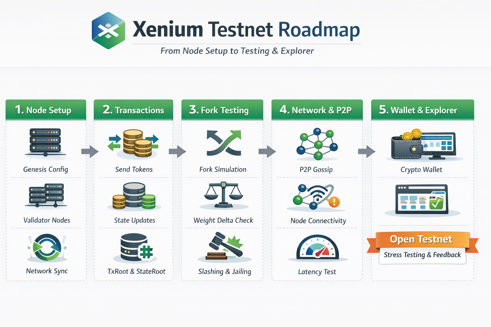
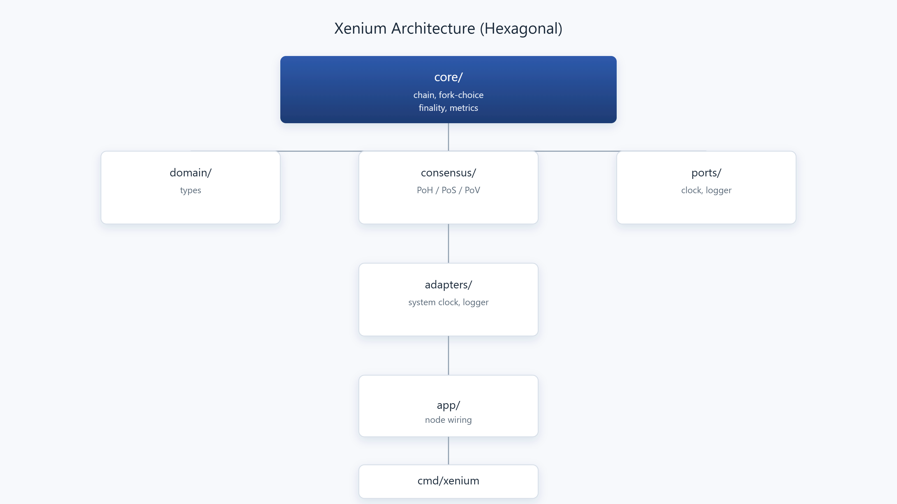

# Xenium




*Xenium Testnet Roadmap.*

## Summary

Xenium is a single-node, experimental blockchain consensus engine written in Go. It combines PoH (time), PoS (stake), and PoV (state validity) with deterministic fork-choice, reorg guards, and epoch stake snapshots. The architecture is hexagonal to keep core consensus deterministic and infrastructure swappable.

## Architecture



*Xenium Architecture Diagram.*

## Consensus Overview

- **PoH (Proof of History):** deterministic tick/slot time source
- **PoS (Proof of Stake):** stake-weighted leader selection
- **PoV (Proof of Validity):** state transition validation and signature checks

## Fork-Choice Specification

Fork-choice is deterministic and weight-first:

1. **Highest cumulative weight** (sum of epoch snapshot stake over the chain)
2. **Highest slot**
3. **Smallest hash** (tie-breaker)

Reorg is allowed only if:

- Reorg depth <= `MaxReorgDepth`
- Reorg does not touch finalized slots
- `newWeight >= oldWeight + MinReorgWeightDeltaP% * activeStake`

Active stake excludes jailed validators.

## Epoch Stake Snapshots

- `epoch = slot / EpochLength`
- At epoch boundaries, active stake is snapshotted and frozen for the epoch
- Snapshots are used for fork-choice weight, reorg weight delta, and leader selection

## Slashing and Jail

- **Missed slot slashing:** missed slot counter per validator; threshold triggers slash + jail
- **Equivocation slashing:** double-producer detection per slot triggers slash + jail
- **Jailed validators** are excluded from active stake and snapshots

## Configuration

Config is injected via `app.Config`:

- `MaxReorgDepth`: maximum allowed reorg depth
- `FinalitySlots`: N-slot finality window
- `MinReorgWeightDeltaP`: minimum percent of active stake required to reorg
- `EpochLength`: slots per epoch for stake snapshots

Default values are defined in `app/config.go`.

## Running

```powershell
go run ./cmd/xenium
```

## Project Status

- Single-node simulation only
- No P2P, networking, or persistent storage
- Consensus engine and observability layers are stable enough for controlled experiments

## Testnet Roadmap

1. **Setup Node & Genesis**
- Create a multi-validator genesis, define validator keys, stake, and initial balances, and verify sync from genesis.

2. **Consensus & Reorg Testing**
- Run with weight-first + minDelta, simulate minor and heavier forks, and monitor missed slots, jailing, and slashing.

3. **Transaction Flow Test**
- Send transfers and verify balances, PoH hash, TxRoot, and StateRoot.

4. **P2P / Network Layer**
- Implement discovery and gossip, simulate offline/reconnect, and monitor latency and propagation.

5. **Wallet & Explorer (Optional)**
- Connect a wallet and expose blocks, slots, and validator stats via an explorer.

6. **Public Testnet**
- Open to external validators/users with test tokens and collect feedback/bugs.

7. **Stress Test & Metrics**
- Run high throughput tests and track fork frequency, missed slots, and chain weight.

## Formal Invariants

- **Deterministic fork-choice:** ordering is weight -> slot -> hash with explicit reorg guards
- **Snapshot safety:** epoch stake snapshots are immutable during an epoch
- **Finality safety:** reorgs cannot touch finalized slots
- **Slashing correctness:** equivocation and missed-slot thresholds must produce slash + jail

## Quick Links

- `core/` — chain engine, fork-choice, finality, metrics
- `consensus/` — PoH / PoS / PoV logic
- `domain/` — data structures and value objects
- `cmd/xenium/` — CLI entrypoint
